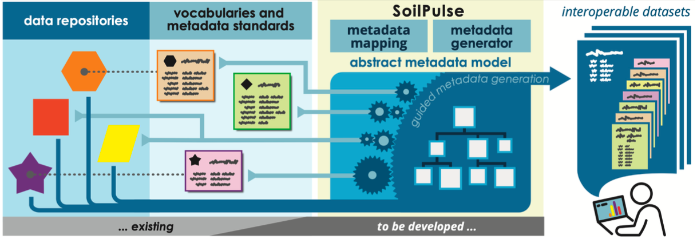

## Purpose
SoilPulse Core was developed to give a intial gues on the structure of a dataset (provided as file or by URL or DOI) and to assign relevant metadata.
Therein SoilPulse Core makes use of the [frictionless table schema](https://specs.frictionlessdata.io/table-schema/) and [frictionless py](https://github.com/frictionlessdata/frictionless-py)  to utilize those validation and transformation capabilities.

### Machine readability
A convienient way is to document  data in a self defined structure (e.g. spreading values across an Excel sheet).

**ToDo: Image needs to be replaced**

Even this allows fast insights and analysises such a structure is not machine readable without parsing instructions.
On the other hand strictly tabular data in csv files is usually machine readable.
So one purpose of SoilPulse is to persist parsing instructions from your data to a machine readable data structure.

### Concept, Unit and Method assignment
Describing the data with the correct unit assures that data values are interpreted correctly by other users.

By assigning concepts of controlled vocabularies we assure that the same measured parameter is found across datasets.
E.g. **T**otal **O**rganic **C**arbon of a soil sample can be abreviated by "TOC", but other publications may have used the abbreviation "Corg" (Carbon, organic) in their data.
By assigning both to the agrovoc concept [soil organic carbon](http://aims.fao.org/aos/agrovoc/c_389fe908) a semantical consens is assured and users can find data of both datasets.

Depending on the specific research question the method applied to measure a parameter can become of concern, so it is a needed information for reusing data.

We found that the two data providing platforms [Bonares repository](https://maps.bonares.de/mapapps/resources/apps/bonares/index.html) and [pangaea](https://www.pangaea.de/) are allready using these three metadata information in their metadata schemas.
Pangaea does even allow to search for and query data across datasets by an applied method or defined parameter by a [data warehouse](https://www.pangaea.de/tools/).

### Application examples
You can explore functionalities of SoilPulse core in these examples:
- [Load data by DOI]()
- [Load data by URL]()
- [Provide own file]()
- [Preparing a user defined mapping of Concept, Unit, Method]()
- [Create a machine readable dataset from your primary data]()
